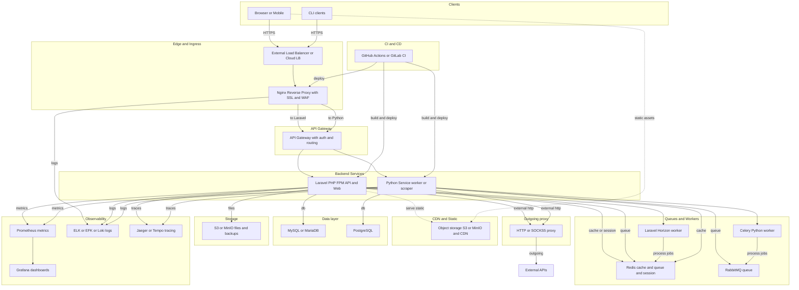

```mermaid
flowchart TB
    subgraph Clients ["Clients"]
        Browser[Browser or Mobile]
        CLI[CLI clients]
    end

    subgraph CDN ["CDN and Static"]
        Static[Object storage S3 or MinIO and CDN]
    end

    subgraph Edge ["Edge and Ingress"]
        LB[External Load Balancer or Cloud LB]
        Nginx[Nginx Reverse Proxy with SSL and WAF]
    end

    subgraph Gateway ["API Gateway"]
        APIGW[API Gateway with auth and routing]
    end

    subgraph Backend ["Backend Services"]
        Laravel[Laravel PHP FPM API and Web]
        Python[Python Service worker or scraper]
    end

    subgraph Queue ["Queues and Workers"]
        Redis[Redis cache and queue and session]
        RabbitMQ[RabbitMQ queue]
        Horizon[Laravel Horizon worker]
        Celery[Celery Python worker]
    end

    subgraph DataLayer ["Data layer"]
        MySQL[MySQL or MariaDB]
        Postgres[PostgreSQL]
    end

    subgraph Storage ["Storage"]
        S3[S3 or MinIO files and backups]
    end

    subgraph Proxy ["Outgoing proxy"]
        ProxyHTTP[HTTP or SOCKS5 proxy]
    end

    subgraph Observability ["Observability"]
        Prometheus[Prometheus metrics]
        Grafana[Grafana dashboards]
        ELK[ELK or EFK or Loki logs]
        Jaeger[Jaeger or Tempo tracing]
    end

    subgraph CI_CD ["CI and CD"]
        GitHub[GitHub Actions or GitLab CI]
    end

    Browser -->|HTTPS| LB
    CLI -->|HTTPS| LB
    LB --> Nginx
    Nginx -->|to Laravel| APIGW
    Nginx -->|to Python| APIGW
    APIGW --> Laravel
    APIGW --> Python

    Laravel -->|cache or session| Redis
    Laravel -->|queue| Redis
    Laravel -->|db| MySQL
    Laravel -->|files| S3
    Laravel --> Horizon
    Horizon -->|process jobs| Redis

    Python -->|cache| Redis
    Python -->|queue| RabbitMQ
    Python -->|db| Postgres
    Python --> Celery
    Celery -->|process jobs| RabbitMQ

    Laravel -->|external http| ProxyHTTP
    Python -->|external http| ProxyHTTP
    ProxyHTTP -->|outgoing| ExtExternal[External APIs]

    Laravel -.->|serve static| Static
    Browser -.->|static assets| Static

    Laravel -->|metrics| Prometheus
    Python -->|metrics| Prometheus
    Nginx -->|logs| ELK
    Laravel -->|logs| ELK
    Python -->|logs| ELK
    Prometheus --> Grafana
    Laravel -->|traces| Jaeger
    Python -->|traces| Jaeger

    GitHub -->|build and deploy| Laravel
    GitHub -->|build and deploy| Python
    GitHub -->|deploy| Nginx
```
